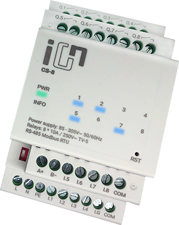

# ha-smart-ion

Українською | [English](README.en.md)


[](https://github.com/hacs/integration)
[](https://github.com/szheliab/ha-smart-ion/actions/workflows/validate.yml)

Підтримка Modbus для Home Assistant для 8-канальних модулів реле/контакторів
[**Smart iON CS-8**](https://smart-ion.com/product/cs-8/), побудована на основі
[нового фреймворку Modbus Connection](https://developers.home-assistant.io/docs/modbus/introduction).



Кожен модуль Smart iON CS-8 надає:

- 8 керованих релейних котушок (`0x000`-`0x007`),
- 8 дискретних входів (`0x000`-`0x007` через функцію `0x02`),
- діагностику у вхідних регістрах (назва модуля, серійний номер, прошивка, час
  роботи, лічильники запитів/помилок),
- налаштування у регістрах утримання (`0x0100`-`0x0104`).

Цей репозиторій містить дві незалежні складові:

## Структура проєкту

```
ha-smart-ion/
├── custom_components/smart_ion/  # кастомна інтеграція для HACS
├── device-library/               # окремий Python-пакет smart-ion-modbus
│   ├── src/smart_ion/            # модель пристрою/компонентів (реле, входи, діагностика, налаштування, таймери)
│   ├── tests/                    # набір тестів pytest
│   └── script/                   # допоміжні скрипти format/check/query
├── config/                       # конфігурація HA у devcontainer для локального тестування custom_components/
├── scripts/                      # скрипти setup/develop/lint 
├── hacs.json                     # маніфест HACS 
└── README.md                     # цей файл
```

## [`custom_components/smart_ion/`](custom_components/smart_ion) — кастомна інтеграція для HACS

Кастомна інтеграція, яку можна встановити через HACS, на основі шаблону
[`ludeeus/integration_blueprint`](https://github.com/ludeeus/integration_blueprint).

### Встановлення через HACS

1. Натисніть **Open HACS repository** або додайте вручну
   `https://github.com/szheliab/ha-smart-ion` у HACS як власний репозиторій
   (категорія: Integration), після чого встановіть "Smart iON CS-8" і
   перезапустіть Home Assistant.

   [](https://my.home-assistant.io/redirect/hacs_repository/?owner=szheliab&repository=ha-smart-ion&category=Integration)
2. Натисніть **Add integration** або перейдіть у **Settings → Devices &
   Services → Add Integration**, знайдіть "Smart iON CS-8" і запустіть
   майстер налаштування.

   [](https://my.home-assistant.io/redirect/config_flow_start/?domain=smart_ion)

### Встановлення вручну

Скопіюйте `custom_components/smart_ion` у теку `config/custom_components`
вашого Home Assistant і перезапустіть Home Assistant.

### Можливості

- Майстер налаштування підтримує підключення через TCP / RTU-over-TCP шлюзи
  (наприклад, конвертер Waveshare RS485-Ethernet) та пряме серійне
  з'єднання (RS-485/USB), а також дозволяє змінити параметри
  з'єднання/таймауту після встановлення через переналаштування інтеграції.
- 8 сутностей `switch` на модуль — по одній на кожне реле.
- 8 сутностей `binary_sensor` на модуль — по одній на кожен дискретний вхід.
- діагностичні/робочі/налаштувальні сутності `sensor` для ідентифікації
  модуля, прошивки, часу роботи, лічильників запитів/помилок та регістрів
  налаштувань (`0x0100`-`0x0104`).
- 2 сутності `number` для запису тривалості дебаунсу та порогу довгого
  натискання.
- Один запис конфігурації на кожен фізичний модуль CS-8, тож декілька модулів за
  одним шлюзом (з різними Modbus-адресами) налаштовуються незалежно один від
  одного..

### Налаштування

Все налаштування виконується через інтерфейс користувача. Оберіть спосіб
підключення:

- **TCP / RTU-over-TCP** — хост, порт (за замовчуванням `502`), framer
  (`rtu` для шлюзів RTU-over-TCP, `socket` для нативного Modbus TCP), адреса
  пристрою (за замовчуванням `7`), таймаут і затримка підключення.
- **Серійний порт** — шлях до пристрою, швидкість передачі, біти даних,
  парність, стоп-біти, адреса пристрою, таймаут і затримка підключення.

### Розробка

Дивіться [CONTRIBUTING.md](CONTRIBUTING.md) щодо процесу розробки на основі
devcontainer (за зразком
[`ludeeus/integration_blueprint`](https://github.com/ludeeus/integration_blueprint)).

## [`device-library/`](device-library)

Окрема Python-бібліотека для моделювання пристрою (`smart-ion-modbus`),
побудована на [`modbus-connection`](https://pypi.org/project/modbus-connection/)
і створена за зразком
[`Tom-Bom-badil/trovis-modbus`](https://github.com/Tom-Bom-badil/trovis-modbus).
Вона не залежить від Home Assistant і може використовуватися окремо
(включно з CLI `smart-ion-query`) або як залежність кастомної інтеграції
вище.

## Підтримувана карта регістрів пристрою

- 8 релейних котушок за адресами `0x000`-`0x007`
- 8 дискретних входів за адресами `0x000`-`0x007`
- діагностика у вхідних регістрах: `0x00BB`, `0x00C0`, `0x00CC`, `0x0205`,
  `0x020A`, `0x020C`, `0x020E`, `0x0210`
- налаштування у регістрах утримання: `0x0100`-`0x0104`, `0x0421`-`0x0428`,
  `0x0431`-`0x0438`

